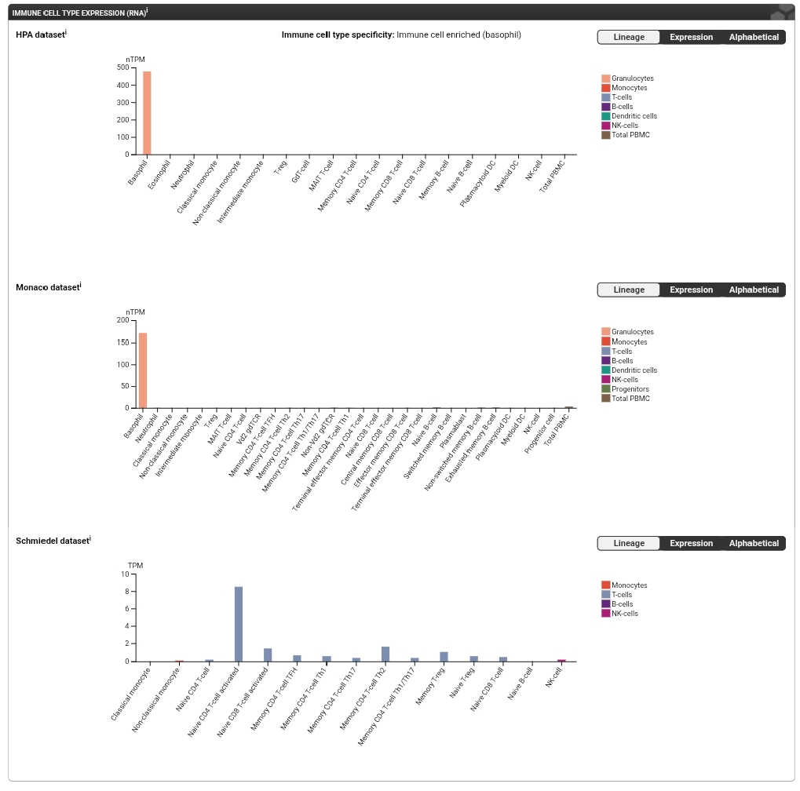
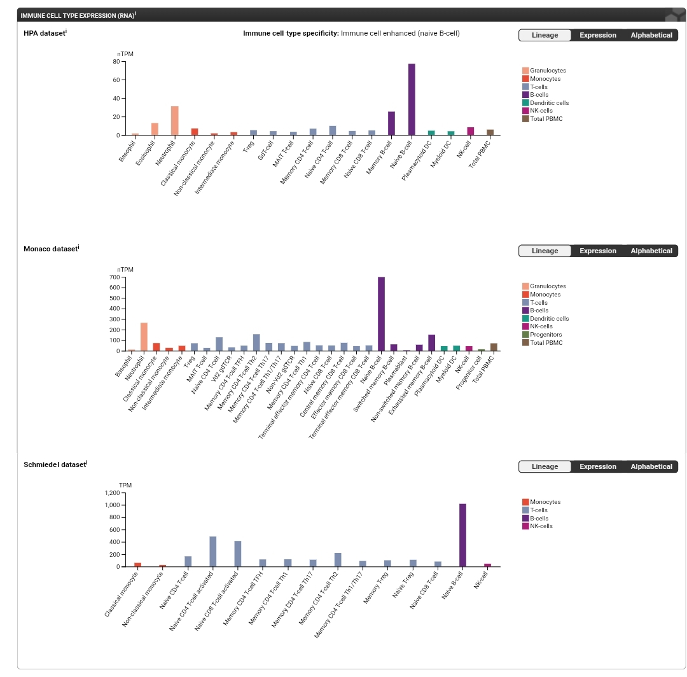
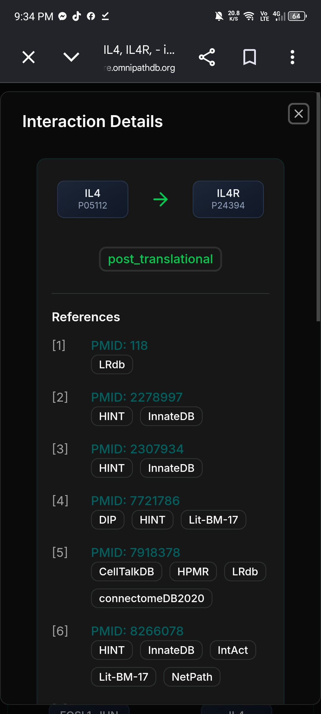
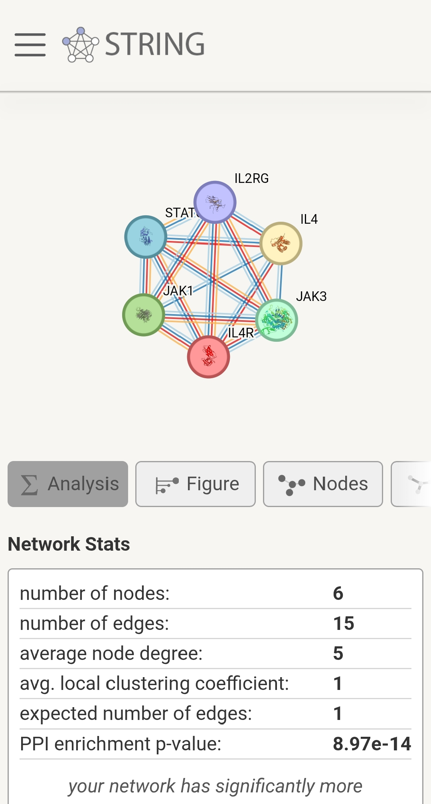
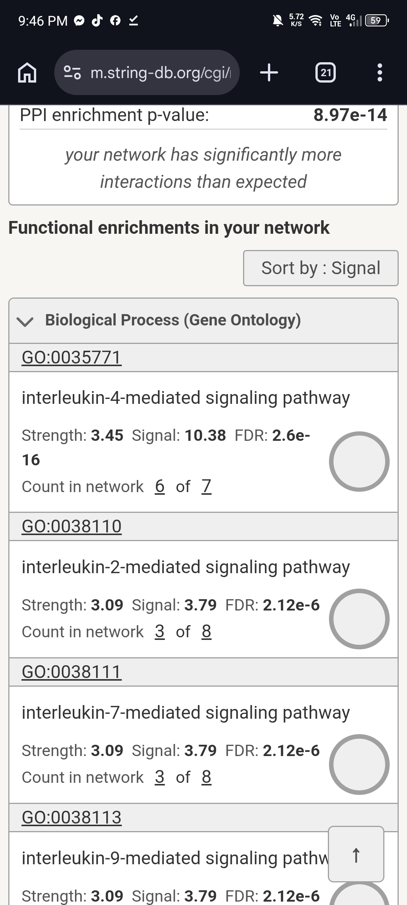
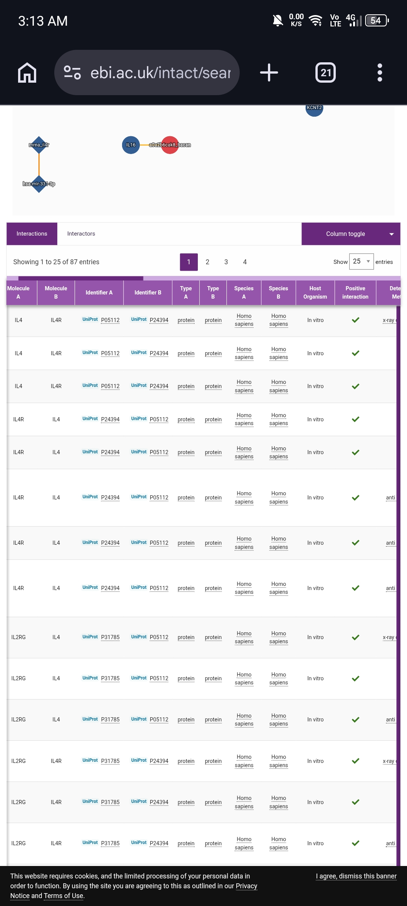
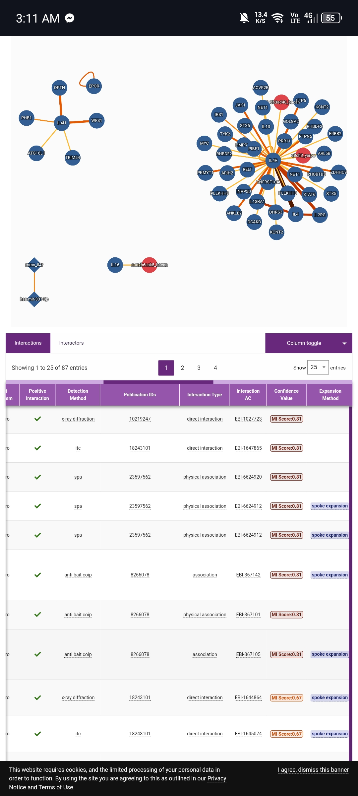
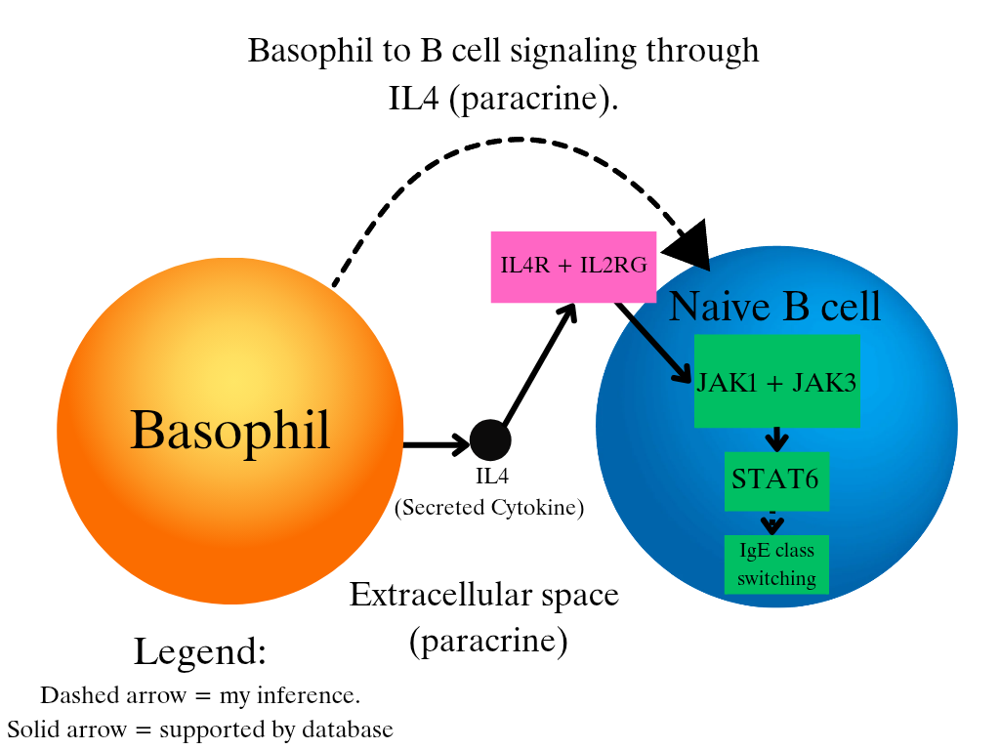

# Cell-to-Cell Communication: Basophil to B cell through IL4

Gedden D. Estrevillo | Cell and Molecular Biology, Section A

## Biological question
Can a basophil send an IL4 signal to a B cell, and what do the databases say about how that signal works?

## Sender cell and context
Sender cell: basophil

Context: allergic (type 2) inflammation.

## Candidate ligand and sender-cell evidence
| Item | Finding |
|---|---|
| Ligand | IL4 (Interleukin-4), a secreted cytokine |
| HPA immune cell data | IL4 RNA is highest in basophils in the HPA dataset and the Monaco dataset |
| HPA label | "Immune cell enriched (basophil)" |
| UniProt (P05112) | Cytokine secreted mainly by mast cells, T cells, eosinophils and basophils |
| Signaling type | Paracrine |
| Caveat | T cells also make IL4. In the Schmiedel dataset (no basophils tested) activated T cells were highest. |

## Receptor and receiver cell
| Item | Finding |
|---|---|
| Receptor | IL4R (alpha chain, P24394), working with IL2RG |
| Receiver cell | Naive B cell |
| HPA evidence | IL4R is highest in naive B cells in all three immune cell datasets (HPA, Monaco, Schmiedel) |
| UniProt evidence | IL4R couples to the JAK/STAT6 pathway and IL4/IL13 responses help regulate IgE production |
| Caveat | IL4R is also expressed in other cells. In the HPA single cell view, neutrophils had the highest signal. |

Checkpoint sentence: The basophil produces IL4, which can signal through IL4R on naive B cells in the context of allergic inflammation and IgE antibody production.

## OmniPath findings
- Annotations: IL4 is labeled a Ligand (SignaLink_function) and an interleukin (HGNC).
- Intercell: IL4 is a ligand (consensus score 21), secreted (score 7) and extracellular (score 6).
- Interactions: directed IL4 -> IL4R interaction with about 20 references from many resources (including IntAct, SIGNOR, SignaLink3).
- Also seen: transcription factors such as STAT6 and GATA3 are listed as regulating the IL4 gene. This is about making IL4 inside the sender, so I did not use it in the model.
- Limit: OmniPath is general and not specific to basophils or B cells. The cell-type evidence comes from HPA.

## STRING network interpretation
- Input: IL4, IL4R, IL2RG, JAK1, JAK3, STAT6 (Homo sapiens)
- Network: 6 nodes, 15 edges, expected edges 1, PPI enrichment p = 8.97e-14

| Source | Enriched term | Proteins in network | FDR |
|---|---|---|---|
| GO Biological Process | interleukin-4-mediated signaling pathway (GO:0035771) | 6 of 7 | 2.6e-16 |
| Reactome | Interleukin-4 and Interleukin-13 signaling (HSA-6785807) | 6 of 107 | 7.71e-11 |
| KEGG | JAK-STAT signaling pathway (hsa04630) | 6 of 166 | 4.96e-11 |

Proteins that connect the receptor to the response:
- IL2RG: partner chain in the IL4 receptor complex
- JAK1 and JAK3: kinases that start the signal inside the cell
- STAT6: transcription factor that carries the signal to the nucleus

Caution: I picked these six proteins because I already knew they belong to IL4 signaling, so the strong enrichment is partly built in. It supports the pathway but does not discover it. A STRING edge means a functional association, not proof of direct binding or direction. KEGG also listed "Pathways in cancer" and "Inflammatory bowel disease", which do not fit my model, so I ignored them.

## IntAct validation
Pair examined: IL4 (P05112) and IL4R (P24394), Homo sapiens. IntAct showed 87 records for my search. I read the first page (25 records).

| Method | PMID | Interaction type | MI score |
|---|---|---|---|
| X-ray diffraction | 10219247 | direct interaction | 0.81 |
| ITC | 18243101 | direct interaction | 0.81 |
| SPA | 23597562 | physical association | 0.81 |
| Anti-bait co-IP | 8266078 | association / physical association | 0.81 |

- One annotation reports a Kd of 1.0 E-9 M for IL-4 binding IL-4Ralpha.
- IL2RG also has records with IL4 and with IL4R.
- Conclusion: the evidence supports direct physical binding between IL4 and IL4R. All records are in vitro. One record comment says the IL4 was expressed in E. coli and that this is not absolutely clear in the paper.

## Final model

### Interpretation
I chose the basophil as my sender cell and followed IL4 from there. In the Human Protein Atlas, IL4 RNA is highest in basophils in two immune cell datasets (HPA and Monaco), and UniProt also lists basophils as a source. T cells make IL4 too, so basophils are not the only source. IL4 is secreted, so I treated this as paracrine signaling.

OmniPath labels IL4 as a ligand and lists a directed IL4 to IL4R interaction backed by many references. HPA shows IL4R is highest in naive B cells in three datasets, so I picked B cells as the receiver. IL4R is also found in other cells, like neutrophils, so this choice is partly my own reasoning.

For STRING I entered IL4, IL4R, IL2RG, JAK1, JAK3 and STAT6. They were strongly connected, and the top enriched terms were interleukin-4-mediated signaling and JAK-STAT signaling. I picked these proteins myself, so this supports the pathway but does not discover it. In IntAct, IL4 and IL4R have X-ray diffraction and ITC records labeled direct interaction, but these are in vitro only.

The well supported parts are IL4 binding IL4R and the JAK-STAT pathway. The inferred parts are that basophils signal to B cells in the body and that the result is IgE class switching.

## Answers to the lab questions
1. **Sender cell:** Basophil, a blood granulocyte that acts in allergic (type 2) inflammation.
2. **Signaling molecule:** IL4. HPA shows IL4 RNA is highest in basophils (HPA and Monaco datasets) and UniProt lists basophils as a source.
3. **Receptor and receiver:** IL4R with IL2RG, on naive B cells.
4. **Type of signaling:** Paracrine. IL4 is secreted and acts on nearby cells.
5. **Relevant STRING proteins:** IL2RG (receptor partner), JAK1 and JAK3 (kinases that start the signal), STAT6 (carries the signal to the nucleus). UniProt says IL4 receptor engagement activates JAK3 and JAK1 and then STAT6.
6. **Enriched process:** Interleukin-4-mediated signaling pathway (GO, FDR 2.6e-16), Reactome IL-4 and IL-13 signaling, and KEGG JAK-STAT signaling. All fit my mechanism.
7. **IntAct result:** IL4 and IL4R have X-ray diffraction (PMID 10219247) and ITC (PMID 18243101) records, both labeled direct interaction, in vitro, MI score 0.81.
8. **Strong vs inferred:** Strong: IL4 binds IL4R, and the JAK-STAT pathway. Inferred: that basophils really signal to B cells in the body, that B cells are the receiver, and that the final response is IgE class switching.
9. **Expected response:** Class switching to IgE in the B cell. UniProt says IL4/IL13 responses regulate IgE production, and this fits the allergic context.

## Limits
- I chose the STRING proteins myself, so that network is not an independent discovery.
- IL4 and IL4R are also expressed in other cells (T cells make IL4, neutrophils express IL4R).
- IntAct records are in vitro.
- Databases show that the parts exist and can bind. They do not prove this exact basophil to B cell signal happens in the body.

## References and database links
- Human Protein Atlas (IL4 and IL4R pages): https://www.proteinatlas.org/
- OmniPath: https://omnipathdb.org/
- STRING: https://string-db.org/
- IntAct: https://www.ebi.ac.uk/intact/
- UniProt IL4 (P05112): https://www.uniprot.org/uniprotkb/P05112
- UniProt IL4R (P24394): https://www.uniprot.org/uniprotkb/P24394
- PubMed 10219247: https://pubmed.ncbi.nlm.nih.gov/10219247/
- PubMed 18243101: https://pubmed.ncbi.nlm.nih.gov/18243101/
- PubMed 23597562: https://pubmed.ncbi.nlm.nih.gov/23597562/
- PubMed 8266078: https://pubmed.ncbi.nlm.nih.gov/8266078/
